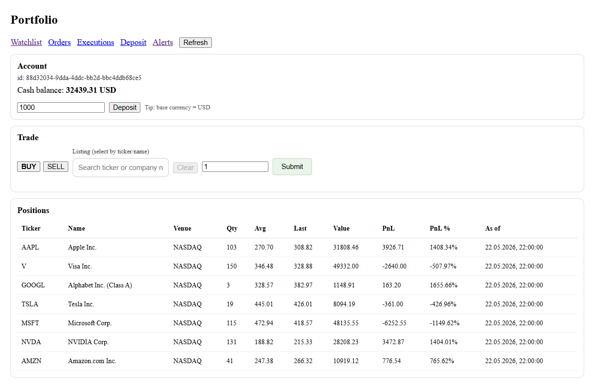
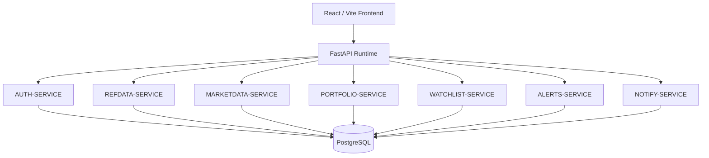

# FinBoard

Microservice-oriented financial analytics platform for market monitoring, portfolio simulation and quantitative analysis.



FinBoard is a full-stack financial platform designed around service boundaries inspired by microservice architecture.

The system provides:
- market data ingestion,
- portfolio simulation,
- alerting,
- watchlists,
- historical OHLCV analysis,
- backtesting capabilities,
- modular financial domain services.

The backend is currently deployed as a modular monolith, while preserving explicit service boundaries, schema-level isolation and a migration path toward independently deployable microservices.

## Features

- JWT authentication & session handling
- Market data ingestion pipeline
- Historical OHLCV processing
- Portfolio & PnL tracking
- Watchlists
- Alert engine
- Backtesting module design
- Modular service-oriented backend
- PostgreSQL schema isolation
- Dockerized infrastructure

## Architecture

FinBoard follows a modular microservice-oriented architecture.

Each domain service owns:
- its own schema,
- its own business logic,
- isolated database access layer,
- dedicated API routes.

Current MVP deployment uses:
- shared PostgreSQL instance,
- single FastAPI runtime,
- Docker-based infrastructure.

This architecture was intentionally designed to allow future extraction into fully independent microservices with minimal refactoring.

### Services

| Service | Responsibility |
|---|---|
| AUTH-SERVICE | Authentication, JWT, sessions, 2FA |
| REFDATA-SERVICE | Instruments & exchange metadata |
| MARKETDATA-SERVICE | OHLCV ingestion and quotes |
| PORTFOLIO-SERVICE | Orders, positions, ledger |
| WATCHLIST-SERVICE | User watchlists |
| ALERTS-SERVICE | Alert evaluation engine |
| BACKTEST-SERVICE | Strategy backtesting |
| NOTIFY-SERVICE | Notifications |

```
Frontend (React/Vite)
        |
        v
 FastAPI Gateway
        |
 ------------------------------------------------
 | AUTH | MARKETDATA | PORTFOLIO | ALERTS | ...
 ------------------------------------------------
        |
    PostgreSQL
```

## Tech Stack

### Backend
- FastAPI
- SQLAlchemy
- PostgreSQL
- Pydantic
- JWT Authentication

### Frontend
- React
- Vite
- TypeScript
- TailwindCSS

### Infrastructure
- Docker
- Docker Compose

### Market Data
- Yahoo Finance
- Finnhub API

## Quick Start

### Prerequisites

- Docker Desktop
- Node.js 18+
- Python 3.10+
- PowerShell

### 1. Clone repository

```powershell
git clone https://github.com/Shakalito/finboard.git
cd finboard
```

### 2. Configure environment
```
copy .env.example .env
```

Fill required environment variables, including database settings and external market data API keys.

### 3. Start database
```
docker compose down   
docker compose up -d
```

### 4. Create and activate Python virtual environment
```
python -m venv .venv   
.\.venv\Scripts\Activate   
python -m pip install --upgrade pip   
```

Install backend dependencies according to the project dependency file:
```
pip install -r requirements.txt
```

If backend dependencies are stored inside `/backend`, use:
```
pip install -r backend\requirements.txt
```
### 5. Seed market data
```
.\seed_OHLCV.ps1
```
### 6. Run backend
```
cd backend   
uvicorn src.main:app --reload   
```

API: http://localhost:8000

Swagger UI: http://localhost:8000/docs

### 7. Run frontend

Open another terminal:
```
cd frontend
npm install
npm run dev
```

Frontend: http://localhost:5173



## Documentation

- [System Architecture](docs/architecture/system-overview.md)
- [Service Boundaries](docs/architecture/service-boundaries.md)
- [Database Design](docs/database/database-design.md)
- [Local Development](docs/deployment/local-development.md)

### Backend Services

- [AUTH-SERVICE](docs/backend/auth-service.md)
- [REFDATA-SERVICE](docs/backend/refdata-service.md)
- [MARKETDATA-SERVICE](docs/backend/marketdata-service.md)
- [PORTFOLIO-SERVICE](docs/backend/portfolio-service.md)
- [WATCHLIST-SERVICE](docs/backend/watchlist-service.md)
- [ALERTS-SERVICE](docs/backend/alerts-service.md)
- [NOTIFY-SERVICE](docs/backend/notify-service.md)

### Frontend

- [Frontend Architecture](docs/frontend/frontend-architecture.md)


## Current MVP Limitations

- Market data ingestion currently relies on free-tier providers
- Historical OHLCV seeding is manual
- Services are deployed within a shared runtime
- Real-time streaming is not yet implemented

## Roadmap

- Redis market cache
- Kafka/RabbitMQ event bus
- Independent service deployment
- gRPC service communication
- Real-time websocket streaming
- Kubernetes deployment