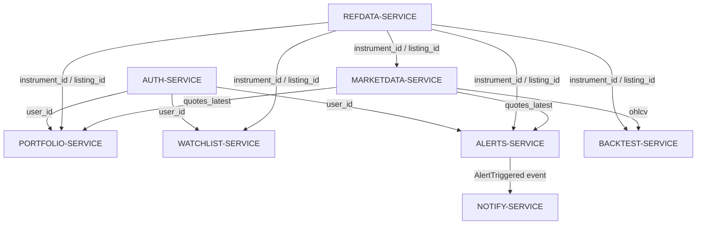
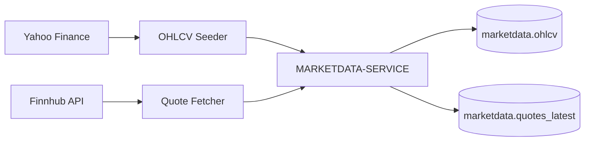
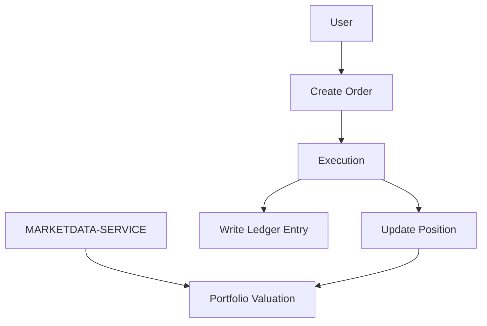
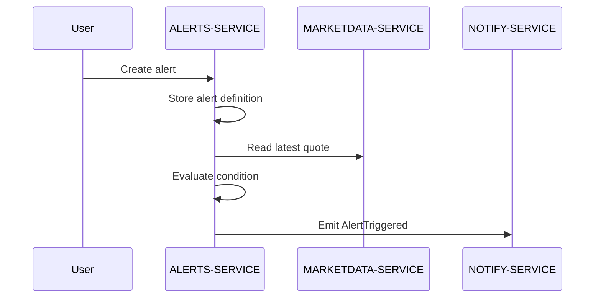

# Service Boundaries

FinBoard is organized around domain services with explicit ownership boundaries.

The current MVP runs inside a shared FastAPI runtime, but the internal structure follows a microservice-oriented design. Each service is responsible for a specific business capability, owns its database schema, exposes its own API routes and should avoid direct writes to another service's data.

## Purpose

This document describes:

- service responsibilities,
- owned data,
- API boundaries,
- dependencies between services,
- rules for cross-service communication,
- migration path toward independently deployable microservices.

## Boundary Principles

FinBoard uses the following service boundary rules:

1. Each service owns its own domain.
2. Each service owns its own database schema.
3. Services should not write to tables owned by other services.
4. Shared identifiers use UUIDs.
5. `auth.users.id` is the global user identifier.
6. `refdata` is the source of truth for financial instruments and listings.
7. `marketdata` is the source of truth for market prices.
8. Historical data and current price snapshots are treated separately.
9. Events should be introduced for asynchronous communication between services.
10. A service may read external identifiers, but should not mutate another service's domain state.

## Service Boundary Map



## AUTH-SERVICE

### Responsibility

AUTH-SERVICE is responsible for user identity and access control.

Its role is to authenticate users and provide a global user identifier that can be referenced by other services.

### Owned Data

Schema: `auth`

Typical tables:

- `auth.users`
- `auth.user_sessions`

Potential future tables:

- `auth.password_resets`
- `auth.login_audit`
- `auth.two_factor_tokens`

### Public API

Example endpoints:

- `POST /auth/register`
- `POST /auth/login`
- `POST /auth/refresh`
- `POST /auth/2fa/verify`

### Ownership Rules

AUTH-SERVICE owns user identity.

Other services may store `user_id` as a reference, but they should not modify user authentication data directly.

### Downstream Consumers

Services depending on AUTH-SERVICE:

- PORTFOLIO-SERVICE
- WATCHLIST-SERVICE
- ALERTS-SERVICE
- NOTIFY-SERVICE

### Migration Notes

When extracted into a separate microservice, AUTH-SERVICE should become the identity provider for the platform.

Possible future improvements:

- refresh token rotation,
- login audit trail,
- 2FA,
- OAuth/OpenID Connect,
- rate limiting for authentication endpoints.

## REFDATA-SERVICE

### Responsibility

REFDATA-SERVICE is responsible for reference data.

It defines the canonical representation of financial instruments, exchanges, venues, listings, calendars and FX data.

It is the source of truth for:

- `instrument_id`,
- `venue_id`,
- `listing_id`.

### Owned Data

Schema: `refdata`

Typical tables:

- `refdata.instruments`
- `refdata.venues`
- `refdata.listings`
- `refdata.calendars`
- `refdata.fx_rates_daily`
- `refdata.corporate_actions`

### Public API

Example endpoints:

- `GET /refdata/instruments`
- `GET /refdata/listings`
- `GET /refdata/venues`
- `GET /refdata/venues/{id}/calendar`

### Ownership Rules

REFDATA-SERVICE owns all static and semi-static market metadata.

Other services should reference instruments and listings by UUID, but should not create or mutate reference data directly.

### Downstream Consumers

Services depending on REFDATA-SERVICE:

- MARKETDATA-SERVICE
- PORTFOLIO-SERVICE
- WATCHLIST-SERVICE
- ALERTS-SERVICE
- BACKTEST-SERVICE

### Migration Notes

When extracted into a separate microservice, REFDATA-SERVICE should expose stable read APIs used by all financial domain services.

Possible future improvements:

- importers for external symbol databases,
- corporate actions normalization,
- exchange calendar support,
- FX conversion layer,
- symbol mapping between providers.

## MARKETDATA-SERVICE

### Responsibility

MARKETDATA-SERVICE is responsible for market data ingestion, normalization and access.

It handles:

- historical OHLCV data,
- latest quotes,
- external market data providers,
- normalization to internal instrument/listing identifiers.

### Owned Data

Schema: `marketdata`

Typical tables:

- `marketdata.ohlcv`
- `marketdata.quotes_latest`
- `marketdata.news_articles`
- `marketdata.news_sentiment`

### Public API

Example endpoints:

- `GET /marketdata/ohlcv`
- `GET /marketdata/quotes/latest`
- `POST /marketdata/seed`
- `GET /marketdata/instruments/{id}/history`

### Data Flow



### Ownership Rules

MARKETDATA-SERVICE owns market prices.

Other services should not fetch, normalize or persist price data independently. If another service needs market prices, it should query MARKETDATA-SERVICE or use events/cache exposed by it.

### Downstream Consumers

Services depending on MARKETDATA-SERVICE:

- PORTFOLIO-SERVICE for portfolio valuation and PnL,
- ALERTS-SERVICE for price alert evaluation,
- BACKTEST-SERVICE for historical strategy evaluation,
- frontend charts for OHLCV visualization.

### Historical vs Current Data

The service separates historical and current market data:

| Data Type | Storage | Used By |
|---|---|---|
| Historical OHLCV | `marketdata.ohlcv` | charts, backtesting |
| Latest quotes | `marketdata.quotes_latest` | alerts, portfolio valuation |

### Migration Notes

When extracted into a separate microservice, MARKETDATA-SERVICE should become independently scalable because market data workloads can be heavier than normal CRUD operations.

Possible future improvements:

- Redis quote cache,
- scheduled ingestion workers,
- websocket quote streaming,
- provider abstraction layer,
- retry and backoff mechanism,
- market data quality checks.

## PORTFOLIO-SERVICE

### Responsibility

PORTFOLIO-SERVICE is responsible for user portfolios, simulated accounts, orders, executions, positions and financial ledger entries.

It models portfolio state and trading activity.

### Owned Data

Schema: `portfolio`

Typical tables:

- `portfolio.accounts`
- `portfolio.account_entries`
- `portfolio.positions`
- `portfolio.orders`
- `portfolio.executions`

### Public API

Example endpoints:

- `POST /portfolio/orders`
- `GET /portfolio/positions`
- `GET /portfolio/account/entries`
- `GET /portfolio/accounts`
- `GET /portfolio/performance`

### Portfolio Model

PORTFOLIO-SERVICE separates trading concepts:

| Concept | Meaning |
|---|---|
| Orders | user intent to buy or sell |
| Executions | completed trades |
| Positions | current asset state |
| Ledger entries | financial accounting record |
| Account | portfolio container owned by user |

### Data Flow



### Ownership Rules

PORTFOLIO-SERVICE owns portfolio state.

It should not own market prices. For valuation and PnL, it should depend on MARKETDATA-SERVICE.

It should not own user authentication. Users are referenced by `user_id` from AUTH-SERVICE.

### Downstream Dependencies

PORTFOLIO-SERVICE depends on:

- AUTH-SERVICE for user identity,
- REFDATA-SERVICE for instrument/listing identifiers,
- MARKETDATA-SERVICE for current prices.

### Migration Notes

When extracted into a separate microservice, PORTFOLIO-SERVICE should expose APIs for accounts, orders, positions and portfolio analytics.

Possible future improvements:

- event-sourced trade history,
- double-entry accounting validation,
- realized/unrealized PnL,
- cash balance reconciliation,
- multiple portfolios per user,
- transaction import.

## WATCHLIST-SERVICE

### Responsibility

WATCHLIST-SERVICE is responsible for user watchlists.

It stores instruments that a user wants to monitor.

### Owned Data

Schema: `watchlist`

Typical tables:

- `watchlist.watchlists`

### Public API

Example endpoints:

- `POST /watchlist`
- `GET /watchlist`
- `DELETE /watchlist/{id}`

### Ownership Rules

WATCHLIST-SERVICE owns the user's watchlist state.

It references:

- `user_id` from AUTH-SERVICE,
- `instrument_id` and `venue_id` or `listing_id` from REFDATA-SERVICE.

It should not store market prices or instrument metadata directly.

### Duplicate Prevention

The service should enforce uniqueness to prevent duplicate entries.

Recommended constraint:

```sql
UNIQUE (user_id, instrument_id, venue_id)
```

or, if listing is the canonical tradable instrument:

```sql
UNIQUE (user_id, listing_id)
```

### Migration Notes

When extracted into a separate microservice, WATCHLIST-SERVICE should remain lightweight and mostly CRUD-oriented.

Possible future improvements:

- watchlist folders,
- ordering and pinning,
- default watchlists,
- shared watchlists,
- watchlist-level alerts.

## ALERTS-SERVICE

### Responsibility

ALERTS-SERVICE is responsible for user-defined alert conditions.

It stores alert definitions and evaluates them against current market data.

Example alert types:

- price above,
- price below,
- percent change,
- volume threshold,
- simple moving average condition.

### Owned Data

Schema: `alerts`

Typical tables:

- `alerts.alerts`
- `alerts.alert_events`

### Public API

Example endpoints:

- `POST /alerts`
- `GET /alerts`
- `PATCH /alerts/{id}`
- `DELETE /alerts/{id}`

### Alert Flow



### Ownership Rules

ALERTS-SERVICE owns alert definitions and alert evaluation logic.

It does not own market prices. It depends on MARKETDATA-SERVICE for current prices.

It does not send notifications directly. It should delegate delivery to NOTIFY-SERVICE.

### Downstream Dependencies

ALERTS-SERVICE depends on:

- AUTH-SERVICE for user identity,
- REFDATA-SERVICE for instrument/listing identifiers,
- MARKETDATA-SERVICE for current quotes,
- NOTIFY-SERVICE for notification delivery.

### Event Contract

Planned event:

```json
{
  "event_type": "AlertTriggered",
  "alert_id": "uuid",
  "user_id": "uuid",
  "instrument_id": "uuid",
  "price": 123.45,
  "timestamp": "2026-05-22T12:00:00Z"
}
```

### Migration Notes

When extracted into a separate microservice, ALERTS-SERVICE should likely run both as an API service and as a background worker.

Possible future improvements:

- scheduled alert evaluator,
- Redis quote cache,
- event bus integration,
- alert cooldowns,
- alert delivery status,
- timezone-aware alert windows.

## NOTIFY-SERVICE

### Responsibility

NOTIFY-SERVICE is responsible for notification delivery.

It receives notification requests or events and sends messages to users through selected channels.

Possible channels:

- email,
- web push,
- SMS,
- in-app notification.

### Owned Data

Schema: optional

The current MVP may keep NOTIFY-SERVICE stateless.

Potential future tables:

- `notify.notification_logs`
- `notify.delivery_attempts`
- `notify.user_notification_preferences`

### Internal API

Example internal endpoint:

- `POST /notify`

### Ownership Rules

NOTIFY-SERVICE owns delivery logic, not business events.

It should not decide whether an alert should trigger. That is ALERTS-SERVICE responsibility.

It should only receive a notification command/event and attempt delivery.

### Migration Notes

When extracted into a separate microservice, NOTIFY-SERVICE should consume events from a queue.

Possible future improvements:

- email provider integration,
- retry policy,
- dead-letter queue,
- delivery templates,
- notification preferences,
- audit log of sent notifications.

## BACKTEST-SERVICE

### Responsibility

BACKTEST-SERVICE is planned for strategy backtesting on historical market data.

It should run strategies on OHLCV datasets and produce performance metrics.

### Owned Data

Schema: `backtest`

Typical planned tables:

- `backtest.strategies`
- `backtest.datasets`
- `backtest.backtests`
- `backtest.backtest_equity`
- `backtest.backtest_trades`
- `backtest.backtest_metrics`

### Public API

Planned endpoints:

- `POST /backtests`
- `GET /backtests/{id}`
- `GET /backtests/{id}/metrics`
- `GET /backtests/{id}/trades`
- `GET /backtests/{id}/equity`

### Ownership Rules

BACKTEST-SERVICE owns backtest definitions and results.

It does not own historical market data. It depends on MARKETDATA-SERVICE for OHLCV.

It should not use latest quotes for strategy simulation. Backtests must be based on historical datasets only.

### Migration Notes

When implemented as an independent service, BACKTEST-SERVICE may require separate workers because strategy execution can be computationally expensive.

Possible future improvements:

- async backtest jobs,
- strategy versioning,
- result caching,
- performance metrics,
- equity curve generation,
- strategy parameter optimization.

## Cross-Service Dependency Matrix

| Service | Depends On | Reason |
|---|---|---|
| AUTH-SERVICE | none | identity provider |
| REFDATA-SERVICE | none | source of truth for instruments |
| MARKETDATA-SERVICE | REFDATA-SERVICE | normalizes data to instrument/listing IDs |
| PORTFOLIO-SERVICE | AUTH, REFDATA, MARKETDATA | user ownership, instruments, valuation |
| WATCHLIST-SERVICE | AUTH, REFDATA | user ownership, instruments |
| ALERTS-SERVICE | AUTH, REFDATA, MARKETDATA, NOTIFY | user alerts, instruments, prices, delivery |
| NOTIFY-SERVICE | AUTH optional | user delivery preferences |
| BACKTEST-SERVICE | REFDATA, MARKETDATA | historical instruments and OHLCV |

## Allowed and Forbidden Operations

### Allowed

A service may:

- read its own tables,
- write its own tables,
- reference UUIDs from another service,
- call another service API,
- consume events from another service,
- publish events about its own domain.

### Forbidden

A service should not:

- write directly to another service's tables,
- duplicate another service's business logic,
- own data that belongs to another domain,
- use database joins as the primary integration mechanism in future distributed deployment,
- fetch external market prices outside MARKETDATA-SERVICE.

## Current Implementation vs Target Architecture

| Area | Current MVP | Target Microservice Architecture |
|---|---|---|
| Runtime | single FastAPI app | independent service runtimes |
| Deployment | shared backend container/runtime | separate containers |
| Database | one PostgreSQL instance, schema isolation | schema isolation or separate DB per service |
| Communication | in-process and database-backed | REST/gRPC/events |
| Events | planned | event bus |
| Scaling | whole backend scales together | service-level scaling |
| Observability | basic logs | tracing, metrics, centralized logs |

## Extraction Strategy

The project can be migrated from modular monolith to independent microservices incrementally.

Recommended order:

1. Extract NOTIFY-SERVICE  
   Low business risk and naturally event-driven.

2. Extract MARKETDATA-SERVICE  
   Market data ingestion can scale independently.

3. Extract ALERTS-SERVICE  
   Alert evaluation benefits from background workers and queue-based processing.

4. Extract AUTH-SERVICE  
   Identity can become an independent provider.

5. Extract PORTFOLIO-SERVICE  
   Portfolio state is more sensitive and should be extracted after contracts stabilize.

6. Extract BACKTEST-SERVICE  
   Backtesting can run as worker-based computation service.

## Summary

FinBoard uses a modular service-oriented backend that defines explicit microservice boundaries before physically splitting services into separate deployments.

This approach keeps the MVP simple while preserving the most important microservice concepts:

- service ownership,
- schema isolation,
- domain boundaries,
- global UUID identifiers,
- clear API contracts,
- migration path to independent services.
