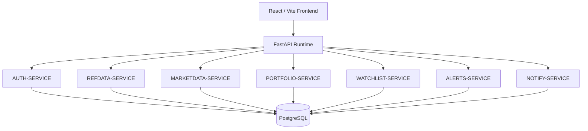
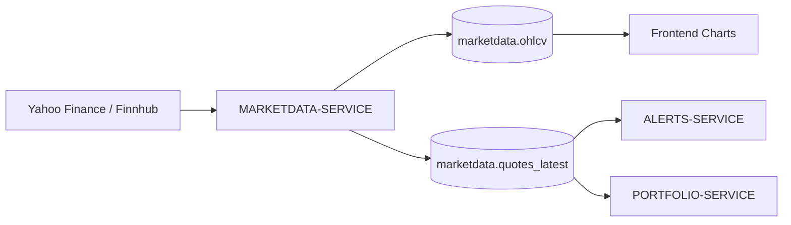
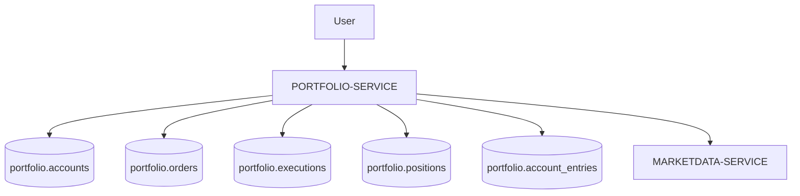
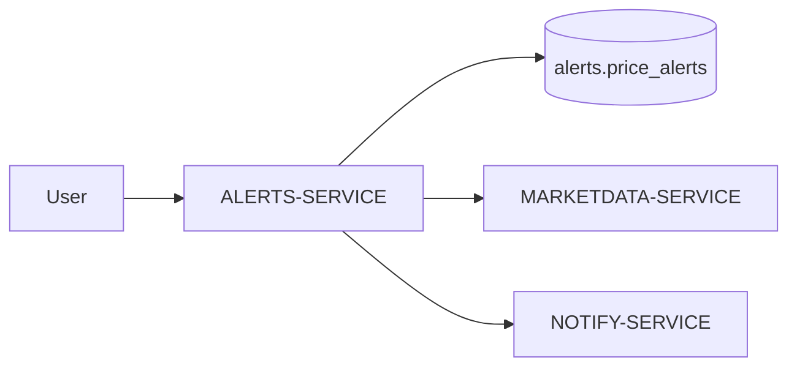
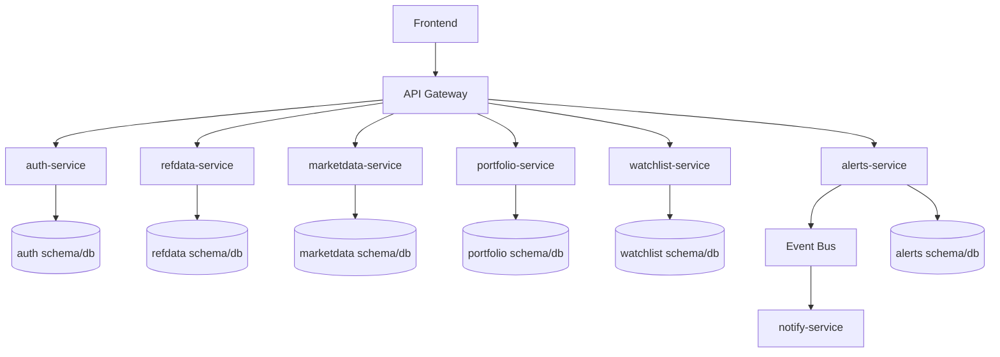

# System Overview

FinBoard is a full-stack financial analytics platform designed around microservice-oriented domain boundaries.

The current MVP is deployed as a modular monolith: all backend domain services run inside a single FastAPI runtime, but each service is separated by responsibility, database schema and API routing. This approach reduces deployment complexity during development while preserving a clear migration path toward independently deployable microservices.

## Table of Contents

- [Architectural Style](#architectural-style)
- [Runtime Model](#runtime-model)
- [High-Level Architecture](#high-level-architecture)
- [Database Architecture](#database-architecture)
- [Identity Model](#identity-model)
- [Core Data Flow](#core-data-flow)
- [Service Boundary Rules](#service-boundary-rules)
- [Current MVP Limitations](#current-mvp-limitations)
- [Migration Path to Independent Microservices](#migration-path-to-independent-microservices)
- [Summary](#summary)

## Architectural Style

FinBoard follows a service-oriented modular architecture inspired by microservices.

The system is organized around domain services:

- AUTH-SERVICE
- REFDATA-SERVICE
- MARKETDATA-SERVICE
- PORTFOLIO-SERVICE
- WATCHLIST-SERVICE
- ALERTS-SERVICE
- NOTIFY-SERVICE
- BACKTEST-SERVICE (planned, data model prepared)

Each service has a clearly defined responsibility and owns its domain model.

## Runtime Model

In the current MVP, backend services are registered inside one FastAPI application.

The main application exposes:

- `/auth`
- `/refdata`
- `/marketdata`
- `/portfolio`
- `/watchlist`
- `/alerts`
- `/health`

This means that services are not yet deployed as independent processes, but their boundaries are already represented in code structure, routing and database schema ownership.

## High-Level Architecture

## Database Architecture

FinBoard uses one PostgreSQL instance.

Instead of using one shared public schema, the database is divided into service-owned schemas:

| Schema | Owner |
|---|---|
| `auth` | AUTH-SERVICE |
| `refdata` | REFDATA-SERVICE |
| `marketdata` | MARKETDATA-SERVICE |
| `portfolio` | PORTFOLIO-SERVICE |
| `watchlist` | WATCHLIST-SERVICE |
| `alerts` | ALERTS-SERVICE |
| `backtest` | BACKTEST-SERVICE | 

The main rule is:

> One service owns one schema.

Services should not directly write to tables owned by another service. Cross-service communication should happen through API calls, events or read-only references where necessary.

## Identity Model

The `auth.users.id` value is the global user identifier used across the system.

All main identifiers use UUIDs. This makes IDs independent from database sequences and supports future service extraction, where services may generate identifiers independently.

## Core Data Flow

### Market Data Flow

MARKETDATA-SERVICE is responsible for historical OHLCV data and current quote snapshots.

Historical data is used by charts and future backtesting logic. Current quote data is used by alerts and portfolio valuation.

### Portfolio Flow

PORTFOLIO-SERVICE separates:

- orders,
- executions,
- positions,
- ledger entries.

Positions represent the current state. Executions represent trade history. Ledger entries preserve financial consistency.

### Alert Flow

ALERTS-SERVICE stores user-defined alert conditions and evaluates them against current market prices. When a condition is met, the service can generate an alert event for NOTIFY-SERVICE.

### Service Boundary Rules

FinBoard follows these architectural rules:

1. Each service owns its own database schema.
2. Services should not perform cross-writes into another service schema.
3. UUID is the default identifier format.
4. AUTH-SERVICE provides global user identity.
5. REFDATA-SERVICE is the source of truth for instruments and listings.
6. MARKETDATA-SERVICE is the source of truth for market prices.
7. PORTFOLIO-SERVICE does not fetch or store market data independently.
8. ALERTS-SERVICE depends on current prices, not historical OHLCV.
9. BACKTEST-SERVICE depends on historical OHLCV only.

### Current MVP Limitations

The current implementation intentionally keeps operational complexity low.

Known limitations:

- services run in a shared FastAPI runtime,
- PostgreSQL is shared across all services,
- inter-service communication is currently implemented through in-process module calls and shared database access,
- event-driven communication is not yet implemented,
- market data ingestion depends on free-tier providers,
- backtesting schema exists, but full backtesting runtime is planned.

## Migration Path to Independent Microservices

The current architecture can be migrated to full microservices by:

1. extracting each service folder into a separate FastAPI application,
2. giving each service its own Dockerfile and runtime,
3. exposing service-specific APIs,
4. replacing direct database joins with REST/gRPC calls or asynchronous events,
5. introducing Redis for short-lived market cache,
6. introducing RabbitMQ or Kafka for events,
7. deploying each service independently.

Planned target architecture:

In a future production-oriented deployment, each service may own either:
- an isolated PostgreSQL schema,
- or an independent database instance,
depending on operational and scaling requirements.

## Summary

FinBoard is currently implemented as a modular monolith with explicit microservice boundaries.

This design was chosen intentionally for an MVP/student portfolio project: it keeps local development simple while demonstrating architectural separation, domain ownership and a clear path toward full microservice deployment.