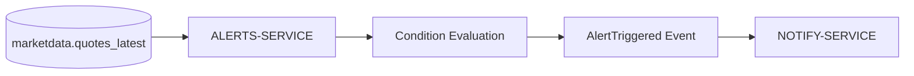

# ALERTS-SERVICE

## Overview

ALERTS-SERVICE evaluates market conditions and generates user-defined trading alerts.

The service supports alert-based workflows such as:

- price alerts,
- percentage movement alerts,
- volume alerts,
- simple technical indicators.

The service depends on realtime market snapshots provided by MARKETDATA-SERVICE.

---

# Responsibilities

ALERTS-SERVICE is responsible for:

- storing alert definitions,
- evaluating market conditions,
- generating alert events,
- triggering notification workflows.

The service does NOT:

- fetch prices independently,
- manage portfolios,
- handle authentication,
- send notifications directly.

---

# Owned Schema

The service owns the `alerts` schema.

## Main Tables

| Table | Purpose |
|---|---|
| `alerts.alerts` | User-defined alert rules |

---

# Alert Processing Flow

---

# Supported Alert Types

Potential alert types include:

- absolute price thresholds,
- percentage movement,
- volume spikes,
- SMA crossovers.

---

# Evaluation Model

The service periodically evaluates:

- latest quotes,
- alert thresholds,
- trigger conditions.

This architecture supports future background workers.

---

# Service Dependencies

## Depends On

| Service | Purpose |
|---|---|
| MARKETDATA-SERVICE | Current quotes |
| AUTH-SERVICE | User identity |

---

## Used By

| Service | Purpose |
|---|---|
| NOTIFY-SERVICE | Notification delivery |
| Frontend | Alert management UI |

---

# Future Improvements

Planned improvements include:

- websocket alerts,
- event streaming,
- distributed workers,
- advanced technical indicators,
- ML-based anomaly detection.

---

# Current MVP Limitations

Known limitations include:

- polling-based evaluation,
- no distributed queue,
- limited alert types,
- shared FastAPI runtime.

---

# Summary

ALERTS-SERVICE provides event-driven monitoring capabilities within FinBoard while remaining isolated from notification delivery and market ingestion responsibilities.
