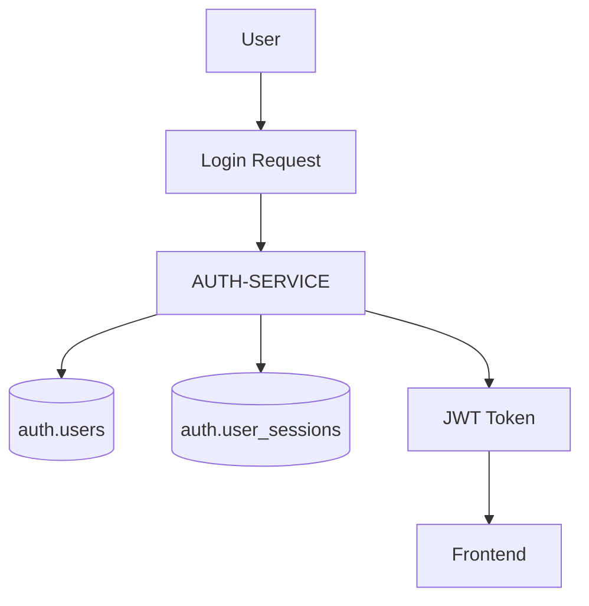
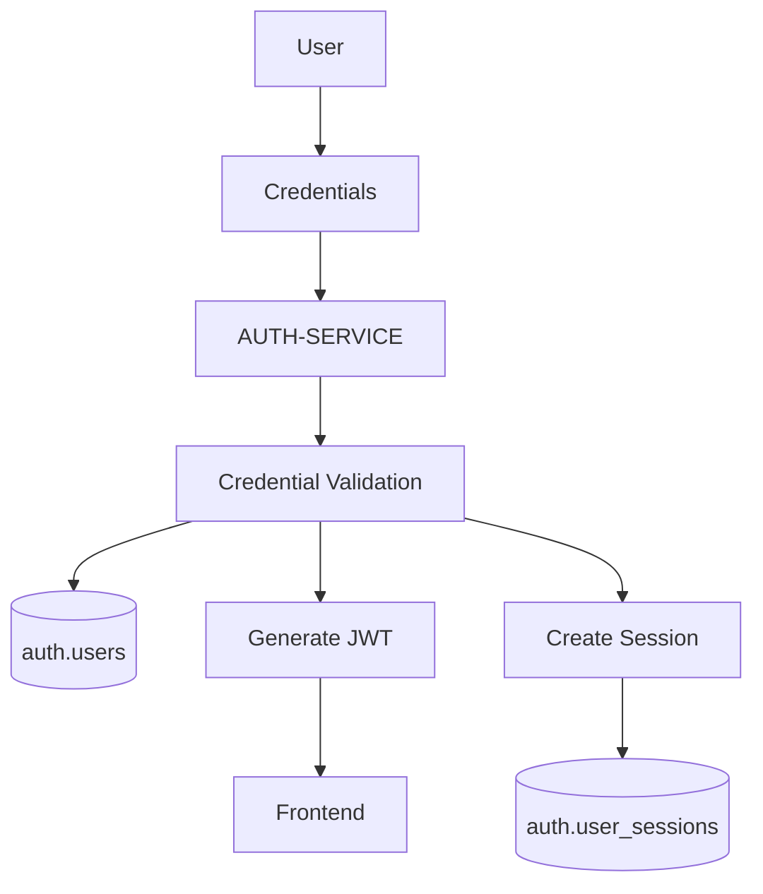
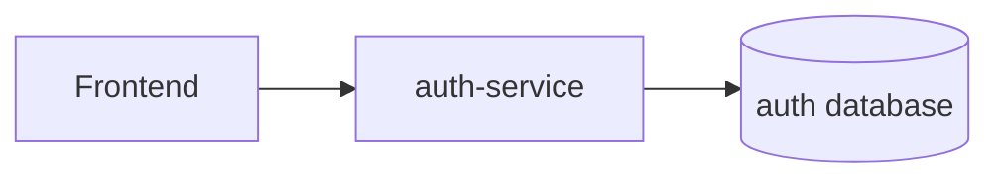

# AUTH-SERVICE

## Overview

AUTH-SERVICE is responsible for authentication, authorization and identity management within FinBoard.

The service acts as the central identity provider for the entire platform.

Its responsibilities include:

- user registration,
- login and authentication,
- JWT token generation,
- session management,
- refresh tokens,
- future 2FA support,
- password reset flows,
- authentication-related security logic.

The service provides the global user identity model used by all other services.

---

# Responsibilities

AUTH-SERVICE is responsible for:

- authenticating users,
- generating JWT tokens,
- validating credentials,
- managing sessions,
- handling refresh tokens,
- securing protected endpoints,
- future audit logging,
- future multi-factor authentication.

The service does NOT:

- manage portfolios,
- manage market data,
- evaluate alerts,
- process financial logic,
- store trading information.

---

# Owned Schema

The service owns the `auth` PostgreSQL schema.

### Main Tables

| Table | Purpose |
|---|---|
| `auth.users` | User identities |
| `auth.user_sessions` | Session tracking and refresh tokens |

---

# Identity Model

The `auth.users.id` value is the global user identifier across the entire platform.

All other services reference users through this identifier.

Example:

- portfolio owner,
- watchlist owner,
- alert owner,
- account owner.

---

# UUID Strategy

AUTH-SERVICE uses UUID identifiers for users and sessions.

Advantages:

- globally unique identifiers,
- independent ID generation,
- easier future service extraction,
- reduced coupling to database sequences.

---

# Authentication Architecture

---

# JWT Authentication

FinBoard uses JWT-based authentication.

## Access Tokens

Access tokens are used for:

- authenticated API requests,
- protected endpoints,
- user authorization.

---

## Refresh Tokens

Refresh tokens are used to:

- extend user sessions,
- avoid repeated logins,
- improve user experience.

Refresh sessions are stored in:

- `auth.user_sessions`

---

# Session Management

The architecture supports session tracking.

Potential session metadata includes:

- refresh token,
- device information,
- IP address,
- expiration timestamps,
- login timestamps.

This enables future:

- session revocation,
- suspicious login detection,
- audit logging,
- multi-device management.

---

# Future 2FA Support

The architecture anticipates future multi-factor authentication support.

Potential implementations include:

- TOTP,
- authenticator applications,
- email verification,
- SMS verification.

Potential endpoint example:

| Endpoint | Purpose |
|---|---|
| `POST /auth/2fa/verify` | 2FA verification |

---

# API Responsibilities

Potential endpoints include:

| Endpoint | Purpose |
|---|---|
| `POST /auth/register` | User registration |
| `POST /auth/login` | User login |
| `POST /auth/refresh` | Refresh access token |
| `POST /auth/logout` | Session invalidation |
| `POST /auth/2fa/verify` | Future 2FA validation |

---

# Authentication Flow

## Login Flow

### Processing Steps

1. User submits credentials.
2. Credentials are validated.
3. Password hash is verified.
4. JWT token is generated.
5. Session is created.
6. Tokens are returned to frontend.

---

# Security Model

## Password Storage

Passwords should never be stored in plaintext.

Passwords are hashed before persistence.

Potential hashing algorithms:

- bcrypt,
- argon2.

---

## JWT Validation

Protected endpoints validate:

- token signature,
- token expiration,
- user identity,
- token integrity.

---

## User Isolation

All authenticated operations should be user-scoped.

Example:

- users can access only their portfolios,
- users can access only their watchlists,
- users can access only their alerts.

---

# Service Dependencies

## Used By

| Service | Usage |
|---|---|
| PORTFOLIO-SERVICE | User identity |
| WATCHLIST-SERVICE | User ownership |
| ALERTS-SERVICE | User ownership |
| Frontend | Authentication |

---

# Failure Isolation

The architecture supports future extraction into a dedicated authentication service.

Potential future deployment:

Advantages include:

- centralized authentication,
- independent scaling,
- security isolation,
- separate deployment lifecycle.

---

# Scalability Considerations

Future improvements may include:

- OAuth integration,
- social login,
- centralized identity provider,
- OpenID Connect,
- distributed session storage,
- Redis session cache,
- rate limiting,
- brute-force protection.

---

# Audit & Security Logging

Future versions may include:

- login history,
- failed login tracking,
- suspicious activity detection,
- audit logs,
- security events.

---

# Current MVP Limitations

Known limitations include:

- shared FastAPI runtime,
- limited session management,
- no distributed auth infrastructure,
- no OAuth provider integration,
- no full 2FA implementation,
- no dedicated auth gateway.

---

# Architectural Importance

AUTH-SERVICE is one of the most important architectural boundaries in FinBoard.

It establishes:

- global identity,
- authorization model,
- user ownership,
- security boundaries.

Because every domain depends on authenticated users, AUTH-SERVICE effectively acts as the identity provider for the platform.

---

# Summary

AUTH-SERVICE provides centralized authentication and identity management within FinBoard.

The service was intentionally designed to:

- isolate security concerns,
- centralize identity,
- support JWT-based authorization,
- enable future scaling,
- support future extraction into an independent authentication microservice.

Although currently deployed inside a modular monolith, the architecture preserves explicit service boundaries and future migration readiness.
