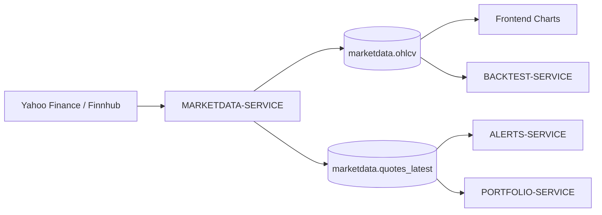
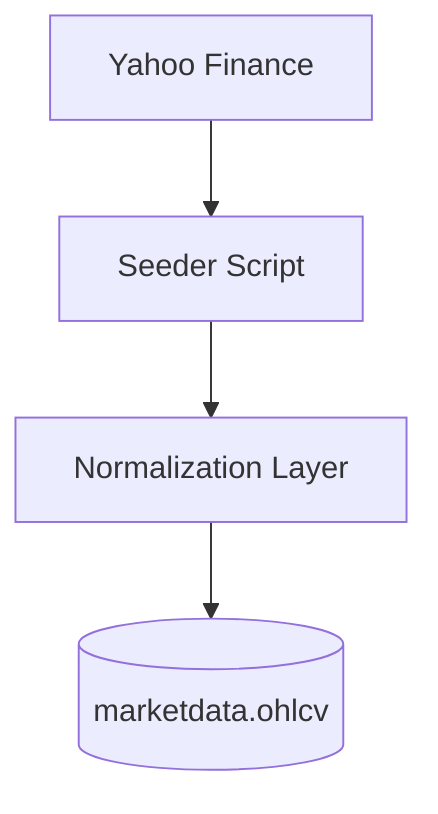
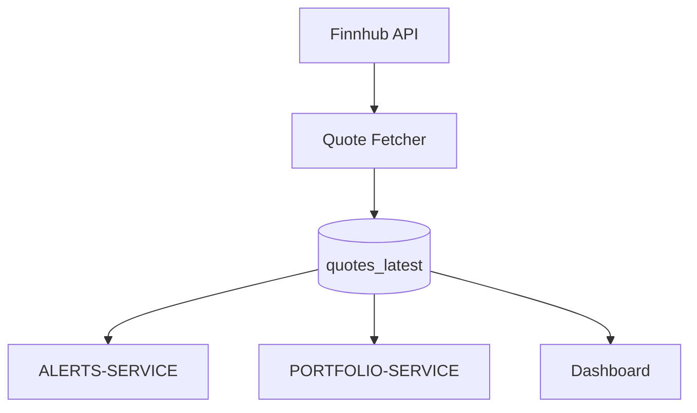

# MARKETDATA-SERVICE

## Overview

MARKETDATA-SERVICE is responsible for financial market data ingestion, normalization and distribution across the FinBoard platform.

The service acts as the primary source of truth for:

- historical OHLCV data,
- current market quotes,
- instrument price snapshots,
- future news and sentiment ingestion.

The service is designed around a separation between:

- historical analytical data,
- realtime market state.

This separation improves scalability, simplifies caching and enables future realtime infrastructure.

---

## Responsibilities

MARKETDATA-SERVICE is responsible for:

- downloading market data from external providers,
- normalizing symbols and listings,
- storing historical OHLCV candles,
- maintaining current quote snapshots,
- exposing market APIs,
- providing data for portfolio valuation,
- providing data for alerts,
- supporting future backtesting functionality.

The service does NOT manage:

- user accounts,
- portfolios,
- watchlists,
- authentication,
- notifications.

---

## Owned Schema

The service owns the `marketdata` PostgreSQL schema.

### Main Tables

| Table | Purpose |
|---|---|
| `marketdata.ohlcv` | Historical candle data |
| `marketdata.quotes_latest` | Current market snapshots |
| `marketdata.news_articles` | Financial news |
| `marketdata.news_sentiment` | Sentiment analysis |

---

## Architecture Role

MARKETDATA-SERVICE sits at the center of the analytical layer.

Multiple services depend on market data:

- ALERTS-SERVICE,
- PORTFOLIO-SERVICE,
- BACKTEST-SERVICE,
- frontend charting.

---

# External Data Providers

## Yahoo Finance

Yahoo Finance is currently used primarily for:

- historical OHLCV seeding,
- bulk historical downloads,
- initial development dataset generation.

### Advantages

- free access,
- broad instrument coverage,
- easy historical access.

### Limitations

- unofficial API,
- rate limits,
- limited reliability,
- not production-grade.

---

## Finnhub

Finnhub is used for:

- current quotes,
- market snapshots,
- lightweight realtime-like updates.

### Advantages

- simple API,
- good free-tier access,
- low integration complexity.

### Limitations

- free-tier restrictions,
- limited throughput,
- no guaranteed low latency.

---

# OHLCV Data Model

## Definition

OHLCV stands for:

| Field | Meaning |
|---|---|
| Open | Opening price |
| High | Highest price |
| Low | Lowest price |
| Close | Closing price |
| Volume | Trading volume |

Each record represents one candle for a specific:

- instrument,
- venue,
- interval,
- timestamp.

---

## Example Intervals

Supported intervals may include:

- 1 minute,
- 5 minutes,
- 15 minutes,
- 1 hour,
- daily,
- weekly.

---

## Historical Data Usage

Historical OHLCV data is used for:

- chart rendering,
- technical analysis,
- future backtesting,
- analytics,
- historical performance tracking.

---

# Current Quotes Model

## quotes_latest

The `quotes_latest` table stores only the latest known market state.

This is intentionally separated from historical OHLCV storage.

### Why Separate Realtime and Historical Data?

Because they have different characteristics:

| Historical OHLCV | Current Quotes |
|---|---|
| Append-heavy | Frequently overwritten |
| Large datasets | Small working set |
| Analytical | Operational |
| Rarely updated | Continuously refreshed |

This separation improves:

- query performance,
- cache efficiency,
- alert processing,
- realtime responsiveness.

---

# API Responsibilities

The service exposes APIs related to market data retrieval.

Potential endpoints include:

| Endpoint | Purpose |
|---|---|
| `GET /marketdata/ohlcv` | Historical candles |
| `GET /marketdata/quotes/latest` | Current quotes |
| `GET /marketdata/instruments/search` | Symbol lookup |
| `GET /marketdata/news` | Market news |

---

# Internal Processing Flow

## Historical Data Pipeline

### Processing Steps

1. Download raw external market data.
2. Normalize timestamps and intervals.
3. Map instruments to internal identifiers.
4. Validate missing values.
5. Store candles in PostgreSQL.

---

## Realtime Quotes Flow

---

# Service Dependencies

## Depends On

| Service | Dependency |
|---|---|
| REFDATA-SERVICE | Instrument metadata |
| AUTH-SERVICE | User authentication indirectly |

---

## Used By

| Service | Usage |
|---|---|
| PORTFOLIO-SERVICE | Portfolio valuation |
| ALERTS-SERVICE | Price evaluation |
| BACKTEST-SERVICE | Historical replay |
| Frontend | Charts and dashboards |

---

# Data Ownership Rules

MARKETDATA-SERVICE owns:

- market prices,
- candles,
- quote snapshots,
- market ingestion logic.

Other services may:

- read market data,
- cache market data,
- reference market data.

Other services should NOT:

- directly modify marketdata tables,
- overwrite quotes,
- manage ingestion.

---

# Scalability Considerations

The architecture was intentionally designed to support future scaling.

## Future Improvements

### Redis Cache

Realtime quotes may later be stored in Redis to reduce database pressure.

Potential use cases:

- quote snapshots,
- alert evaluation,
- websocket streaming.

---

### Event Streaming

Future versions may introduce:

- Kafka,
- RabbitMQ,
- NATS,
- Redis Streams.

This would allow asynchronous quote distribution.

---

### TimescaleDB

Historical OHLCV storage may later migrate to:

- TimescaleDB,
- ClickHouse,
- specialized time-series storage.

This would improve:

- large-scale analytics,
- aggregation performance,
- retention management.

---

# Failure Isolation

The current MVP runs in a shared runtime.

However, the architecture was intentionally designed to allow:

- independent deployment,
- isolated scaling,
- separate workers,
- dedicated ingestion services.

Possible future extraction targets:

- realtime quote worker,
- historical ingestion worker,
- analytics worker,
- news ingestion worker.

---

# Security Considerations

MARKETDATA-SERVICE itself does not manage authentication.

Access control is delegated to:

- AUTH-SERVICE,
- JWT middleware,
- API gateway logic.

---

# Current MVP Limitations

Known limitations include:

- manual historical seeding,
- free-tier provider dependency,
- no realtime websocket streaming,
- limited quote refresh frequency,
- shared FastAPI runtime,
- no distributed message bus.

---

# Summary

MARKETDATA-SERVICE is the central analytical data provider within FinBoard.

The service was designed to separate:

- historical analytics,
- realtime operational data,
- ingestion pipelines,
- downstream consumers.

Although currently deployed inside a modular monolith, the architecture preserves clear boundaries and supports future migration toward independently scalable microservices.
