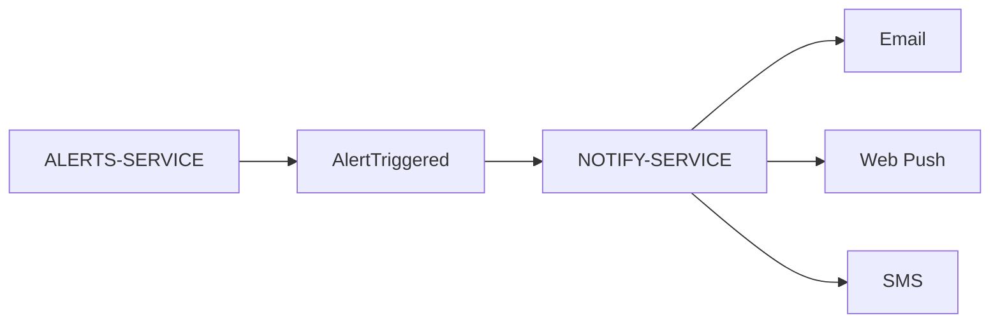

# NOTIFY-SERVICE

## Overview

NOTIFY-SERVICE is responsible for delivering notifications generated by other services.

The service acts as a communication layer between internal events and external notification channels.

Potential notification channels include:

- email,
- web push,
- SMS,
- in-app notifications.

---

# Responsibilities

NOTIFY-SERVICE is responsible for:

- receiving alert events,
- formatting notifications,
- delivering user notifications,
- abstracting notification channels.

The service does NOT:

- evaluate alerts,
- fetch market data,
- manage authentication,
- store portfolio information.

---

# Architectural Role



---

# Event Model

Potential event payload:

```json
{
  "alert_id": "uuid",
  "instrument_id": "uuid",
  "price": 123.45,
  "timestamp": "2026-05-23T12:00:00Z"
}
```

---

# Delivery Channels

## Email

Potential use cases:

- triggered alerts,
- security notifications,
- account verification.

---

## Web Push

Potential future realtime notifications:

- browser push,
- mobile push,
- live market events.

---

## SMS

Potential high-priority alert delivery:

- critical price triggers,
- security events.

---

# Service Dependencies

## Depends On

| Service | Purpose |
|---|---|
| ALERTS-SERVICE | Alert events |
| AUTH-SERVICE | User metadata |

---

# Future Architecture

Future versions may introduce:

- RabbitMQ,
- Kafka,
- Redis Streams,
- asynchronous workers.

This would decouple notification delivery from alert evaluation.

---

# Failure Isolation

NOTIFY-SERVICE is intentionally isolated from business logic.

This improves:

- reliability,
- scalability,
- retry handling,
- independent deployment.

---

# Current MVP Limitations

Known limitations include:

- no real delivery providers,
- no distributed queue,
- no retry engine,
- shared runtime deployment.

---

# Future Improvements

Planned improvements include:

- email provider integration,
- push notification infrastructure,
- delivery retries,
- notification history,
- delivery analytics.

---

# Summary

NOTIFY-SERVICE provides the communication and delivery layer of FinBoard.

The service is intentionally lightweight and event-oriented, supporting future asynchronous and distributed architectures.
