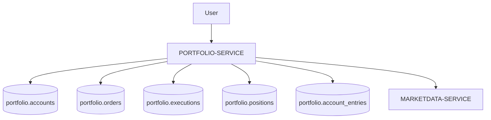
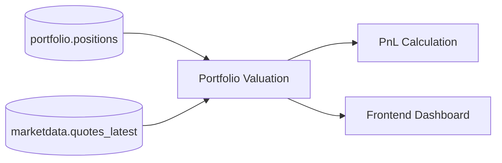
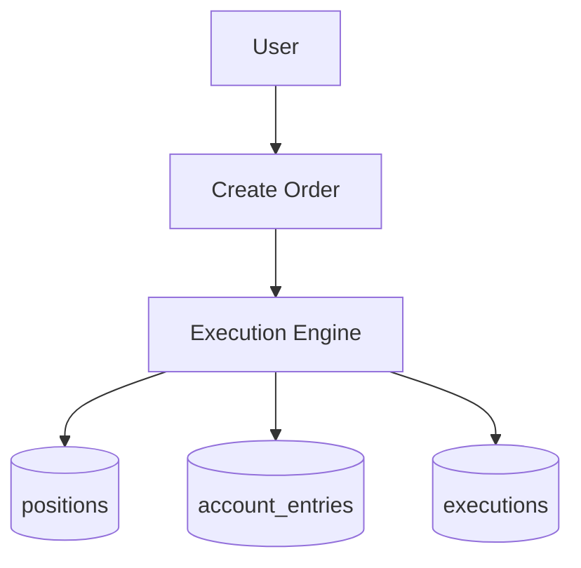

# PORTFOLIO-SERVICE

## Overview

PORTFOLIO-SERVICE is responsible for virtual portfolio management, financial state tracking and trading simulation inside FinBoard.

The service models:

- portfolio accounts,
- orders,
- executions,
- positions,
- cash balances,
- ledger entries,
- profit and loss calculations.

The architecture intentionally separates transactional history from current portfolio state to preserve financial consistency and auditability.

---

## Responsibilities

PORTFOLIO-SERVICE is responsible for:

- managing user portfolio accounts,
- storing simulated orders,
- tracking executions,
- calculating positions,
- maintaining ledger consistency,
- calculating unrealized and realized PnL,
- portfolio valuation,
- balance tracking.

The service does NOT:

- fetch market prices independently,
- manage authentication,
- ingest market data,
- manage watchlists,
- evaluate alerts.

---

## Owned Schema

The service owns the `portfolio` PostgreSQL schema.

### Main Tables

| Table | Purpose |
|---|---|
| `portfolio.accounts` | User portfolio accounts |
| `portfolio.account_entries` | Ledger entries |
| `portfolio.positions` | Current holdings |
| `portfolio.orders` | Order history |
| `portfolio.executions` | Executed trades |

---

# Core Financial Model

PORTFOLIO-SERVICE intentionally separates multiple financial concepts.

## Orders

Orders represent:

- user trading intent,
- requested trade operations,
- pending or historical instructions.

Example:

- buy 10 shares of AAPL,
- sell 5 shares of TSLA.

Orders alone do not change holdings.

---

## Executions

Executions represent:

- completed trades,
- actual trade fills,
- historical transaction records.

An order may produce:

- one execution,
- multiple partial executions,
- no execution.

Executions are immutable historical records.

---

## Positions

Positions represent:

- current portfolio state,
- current holdings,
- current quantity exposure.

Positions are derived from executions.

Example:

| Instrument | Quantity |
|---|---|
| AAPL | 25 |
| TSLA | -5 |

Positions are operational state, not historical truth.

---

## Ledger Entries

Ledger entries preserve financial consistency.

The ledger acts as the accounting backbone of the portfolio system.

### Ledger Responsibilities

The ledger tracks:

- cash movement,
- deposits,
- withdrawals,
- trade settlement,
- balance consistency.

---

# Double-Entry Accounting Concepts

The architecture is inspired by double-entry accounting principles.

Advantages include:

- traceability,
- auditability,
- deterministic balances,
- easier reconciliation,
- safer financial calculations.

Even in a simulated environment, this design improves system correctness.

---

# High-Level Architecture

PORTFOLIO-SERVICE depends on MARKETDATA-SERVICE for current prices.

The service intentionally does not own market price data.

---

# Portfolio Valuation Flow

Portfolio valuation depends on:

- current positions,
- latest market quotes,
- historical execution prices.

---

# API Responsibilities

Potential endpoints include:

| Endpoint | Purpose |
|---|---|
| `POST /portfolio/orders` | Create order |
| `GET /portfolio/positions` | Current positions |
| `GET /portfolio/accounts` | Portfolio accounts |
| `GET /portfolio/executions` | Trade history |
| `GET /portfolio/account/entries` | Ledger history |

---

# Internal Processing Flow

## Order Lifecycle

### Processing Steps

1. User submits order.
2. Order is validated.
3. Simulated execution occurs.
4. Position state updates.
5. Ledger entries are created.
6. Execution history is persisted.

---

# Service Dependencies

## Depends On

| Service | Purpose |
|---|---|
| AUTH-SERVICE | User identity |
| MARKETDATA-SERVICE | Market prices |
| REFDATA-SERVICE | Instrument metadata |

---

## Used By

| Consumer | Purpose |
|---|---|
| Frontend Dashboard | Portfolio visualization |
| Analytics Modules | Performance metrics |
| Future Backtesting | Strategy evaluation |

---

# PnL Model

The service supports:

- unrealized PnL,
- realized PnL,
- account valuation.

## Unrealized PnL

Calculated using:

- current market price,
- average entry price,
- open position size.

---

## Realized PnL

Calculated from:

- closed trades,
- execution history,
- realized exits.

---

# Risk & Consistency

The architecture intentionally minimizes inconsistent financial state.

## Key Principles

### Immutable Executions

Executions should never be rewritten after settlement.

---

### Positions as Derived State

Positions are derived operational state, not canonical history.

Historical truth comes from:

- executions,
- ledger entries.

---

### Ledger as Source of Financial Truth

Cash balance consistency should always be verifiable through ledger entries.

---

# Scalability Considerations

The architecture supports future extraction into independent services.

Potential future components:

- order execution engine,
- portfolio analytics worker,
- realtime valuation worker,
- risk engine,
- reconciliation service.

---

# Future Improvements

Planned future improvements include:

- realtime valuation streaming,
- websocket portfolio updates,
- Redis cache,
- margin simulation,
- advanced order types,
- options and derivatives support,
- multi-currency portfolios,
- event-driven execution processing.

---

# Failure Isolation

The current MVP uses shared runtime infrastructure.

However, the architecture supports future separation into:

- execution workers,
- valuation services,
- reconciliation services,
- independent portfolio APIs.

---

# Security Considerations

PORTFOLIO-SERVICE depends on:

- JWT authentication,
- AUTH-SERVICE identity validation,
- user-scoped queries.

Portfolio data should always remain isolated per authenticated user.

---

# Current MVP Limitations

Known limitations include:

- simulated execution only,
- no real brokerage integration,
- no order book simulation,
- no realtime websocket streaming,
- limited analytics,
- shared FastAPI runtime.

---

# Summary

PORTFOLIO-SERVICE provides the financial state management layer of FinBoard.

The architecture intentionally separates:

- orders,
- executions,
- positions,
- ledger accounting.

This improves:

- consistency,
- traceability,
- auditability,
- scalability,
- future extensibility.

Although currently deployed inside a modular monolith, the design preserves explicit service boundaries and supports future migration toward independently deployable financial services.
