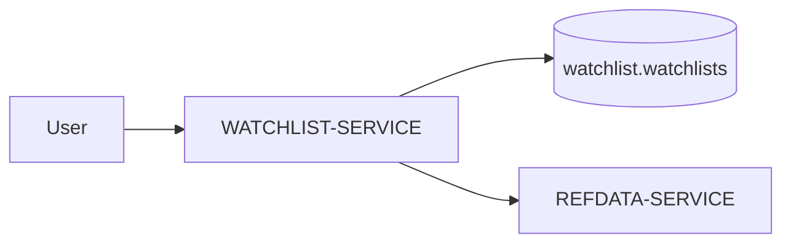

# WATCHLIST-SERVICE

## Overview

WATCHLIST-SERVICE manages user-defined market watchlists.

The service allows users to:

- track instruments,
- organize monitored assets,
- build custom watchlists,
- quickly access market data.

The service intentionally remains lightweight and focused.

---

# Responsibilities

WATCHLIST-SERVICE is responsible for:

- storing watchlists,
- linking users to instruments,
- preventing duplicates,
- exposing watchlist APIs.

The service does NOT:

- store market prices,
- calculate analytics,
- manage authentication.

---

# Owned Schema

The service owns the `watchlist` schema.

## Main Tables

| Table | Purpose |
|---|---|
| `watchlist.watchlists` | User watchlists |

---

# Uniqueness Constraints

The architecture prevents duplicate watchlist entries.

Unique constraint:

```text
(user_id, instrument_id, venue_id)
```

This guarantees:

- no duplicate instruments,
- cleaner user experience,
- simplified frontend rendering.

---

# High-Level Flow



---

# Service Dependencies

## Depends On

| Service | Purpose |
|---|---|
| AUTH-SERVICE | User identity |
| REFDATA-SERVICE | Instrument metadata |

---

# API Responsibilities

Potential endpoints include:

| Endpoint | Purpose |
|---|---|
| `POST /watchlist` | Add instrument |
| `GET /watchlist` | Fetch watchlist |
| `DELETE /watchlist/{id}` | Remove item |

---

# Current MVP Limitations

Known limitations include:

- basic watchlist functionality,
- no folders/tags,
- no realtime synchronization,
- no collaborative watchlists.

---

# Future Improvements

Potential future improvements:

- categorized watchlists,
- drag-and-drop ordering,
- realtime updates,
- shared watchlists,
- websocket synchronization.

---

# Summary

WATCHLIST-SERVICE provides lightweight user-centric market tracking functionality while preserving clear ownership boundaries and modular architecture principles.
