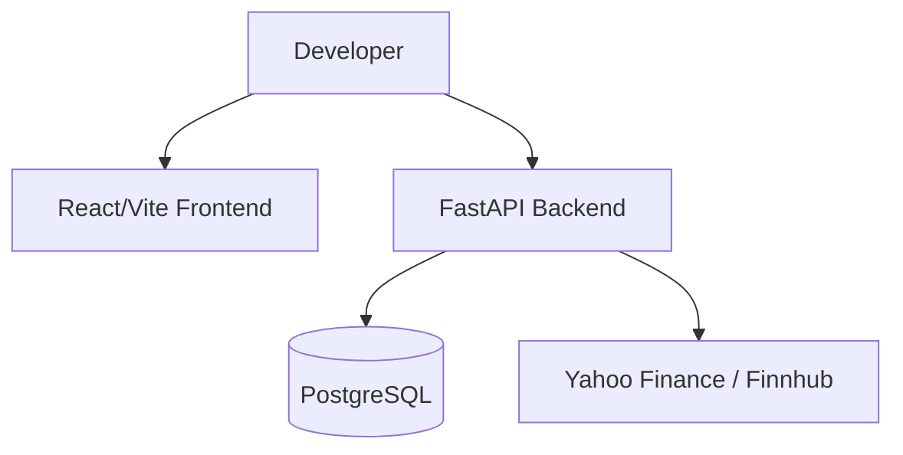

# Local Development Guide

## Overview

This document describes how to run FinBoard locally in a development environment.

The current MVP uses:

- Docker for infrastructure,
- PostgreSQL as the database,
- FastAPI backend runtime,
- React/Vite frontend,
- Python virtual environments for backend development.

The architecture was intentionally optimized for local iteration speed and reduced operational complexity.

---

# Development Environment

## Required Software

Before starting, ensure the following tools are installed:

| Tool | Purpose |
|---|---|
| Docker Desktop | Database container runtime |
| Python 3.10+ | Backend runtime |
| Node.js 18+ | Frontend runtime |
| npm | Frontend dependency management |
| Git | Source control |
| PowerShell | Development scripts |

---

# Repository Structure

Typical project structure:

```text
finboard/
│
├── backend/
├── frontend/
├── docs/
├── docker-compose.yml
├── seed_OHLCV.ps1
└── README.md
```

---

# Clone Repository

Clone the repository locally:

```powershell
git clone https://github.com/Shakalito/finboard.git
cd finboard
```

---

# Environment Configuration

## Create Environment File

Copy the example environment configuration:

```powershell
copy .env.example .env
```

---

## Configure Variables

Fill required values such as:

- database connection settings,
- JWT secrets,
- Finnhub API keys,
- optional external service configuration.

Example:

```env
POSTGRES_USER=postgres
POSTGRES_PASSWORD=postgres
POSTGRES_DB=finboard

JWT_SECRET_KEY=your-secret-key

FINNHUB_API_KEY=your-api-key
```

---

# Database Setup

## Start Docker Infrastructure

Ensure Docker Desktop is running.

From the project root directory:

```powershell
docker compose down
docker compose up -d
```

---

## Verify Containers

Check running containers:

```powershell
docker ps
```

Expected services may include:

- PostgreSQL,
- optional admin tools.

---

# Backend Setup

## Navigate to Backend

```powershell
cd backend
```

---

## Create Virtual Environment

```powershell
python -m venv .venv
```

---

## Activate Virtual Environment

```powershell
.\.venv\Scripts\Activate
```

---

## Upgrade pip

```powershell
python -m pip install --upgrade pip
```

---

## Install Dependencies

If dependencies are stored in backend:

```powershell
pip install -r requirements.txt
```

Or from repository root:

```powershell
pip install -r backend\requirements.txt
```

---

# Historical Market Data Seeding

The MVP currently uses manual OHLCV seeding.

Historical market data is fetched primarily from Yahoo Finance.

## Run Seeder Script

From repository root:

```powershell
.\seed_OHLCV.ps1
```

The seeding process downloads and stores historical candle data into:

- `marketdata.ohlcv`

---

# Running Backend

## Start FastAPI Development Server

Inside `/backend`:

```powershell
uvicorn src.main:app --reload
```

---

## Backend URLs

| Resource | URL |
|---|---|
| API | http://localhost:8000 |
| Swagger UI | http://localhost:8000/docs |
| OpenAPI Schema | http://localhost:8000/openapi.json |

---

# Running Frontend

Open another terminal.

## Navigate to Frontend

```powershell
cd frontend
```

---

## Install Dependencies

```powershell
npm install
```

---

## Start Development Server

```powershell
npm run dev
```

---

## Frontend URL

| Resource | URL |
|---|---|
| Frontend | http://localhost:5173 |

---

# Development Workflow

Typical local workflow:



---

# Hot Reloading

## Backend

FastAPI uses:

- `uvicorn --reload`

This automatically reloads backend code changes.

---

## Frontend

Vite provides:

- fast refresh,
- hot module replacement (HMR),
- instant frontend updates.

---

# Database Notes

The MVP currently uses:

- one PostgreSQL instance,
- schema-per-service organization.

Main schemas include:

| Schema |
|---|
| `auth` |
| `refdata` |
| `marketdata` |
| `portfolio` |
| `watchlist` |
| `alerts` |

---

# Current Development Limitations

Known development limitations include:

- shared runtime architecture,
- no distributed service orchestration,
- manual historical data seeding,
- free-tier market providers,
- limited realtime infrastructure,
- no Kubernetes deployment.

---

# Common Issues

## Missing Python Packages

Example:

```text
ImportError: email-validator is not installed
```

Fix:

```powershell
pip install email-validator
```

Or:

```powershell
pip install "pydantic[email]"
```

---

## Missing yfinance

Example:

```text
ModuleNotFoundError: No module named 'yfinance'
```

Fix:

```powershell
pip install yfinance
```

---

## Docker Not Running

If database startup fails:

- ensure Docker Desktop is running,
- verify containers using `docker ps`.

---

# Recommended Future Improvements

Potential future improvements for local development:

- Dockerized backend runtime,
- Dockerized frontend runtime,
- devcontainer support,
- automated migrations,
- Kubernetes local clusters,
- Redis integration,
- message broker integration.

---

# Production Considerations

The current development setup prioritizes:

- simplicity,
- onboarding speed,
- rapid iteration,
- portfolio presentation.

A future production-oriented setup would likely introduce:

- independent service deployment,
- dedicated infrastructure layers,
- CI/CD pipelines,
- orchestration,
- observability,
- distributed tracing.

---

# Summary

FinBoard uses a lightweight local development workflow optimized for MVP iteration and architectural experimentation.

The development environment intentionally balances:

- simplicity,
- flexibility,
- architectural separation,
- future scalability.

Although currently deployed as a modular monolith, the project structure preserves a clear migration path toward independently deployable microservices.
